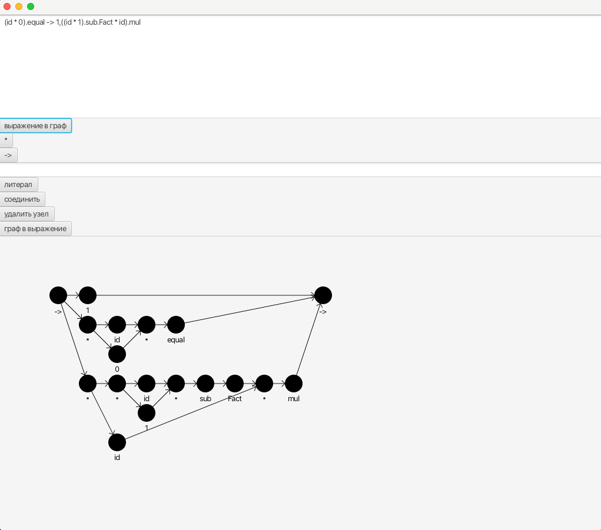

# fptlVisualizer

программа для преобразования функции fptl в графовое представление и наобарот

## fptl

[функциональный язык программирования](https://github.com/Zumisha/FPTL) изобретенный внутри МЭИ В. П. Кутеповым

### операции

#### * - конкатенация (параллельная композиция)
`a*b*c ...`

Этот оператор используется для обозначения параллельного выполнения всех его аргументов.
Он является основным средством для достижения параллелизма в вычислениях

#### . - последовательная композиция
`a.b.c ...`

Вычисляет операнды один за другим последовательно

#### -> тернарный оператор (условная композиция)
`a -> b, c`

вычисляет b если a - истина иначе вычисляет c

### пример программы для вычисления факториала

```fptl
Scheme Fact
{
Fact = (id * 0).equal -> 1,
((id * 1).sub.Fact * id).mul;
}
```

## возможности визуализатора

### Преобразование функции в граф

Для отображения графа по функции надо в верхнее поле вставить функцию без присвоения и точки запятой в конце.
Поддерживаются литералы состоящие из чисел и букв английского алфавита и операции описанные выше.


### Преобразования графа в функцию

#### добавление узлов операций

- нажать на кнопку с соответсвующей операций
- важно, чтобы операцию закрывал правый узел, созданный при нажатии на кнопку
- при соединении операции `->` необходимо добавлять детей в порядке true ветка, условие, false ветка

#### добавление литерала

- ввести название узла в поле над кнопкой литера
- нажать кнопку литерал

#### удаление/соединение

- нажать на кнопку с операцией
- двойным нажатием выбрать узлы

#### преобразование в выражение

- двойным нажатием выбрать узел, с которого необходимо начать преобразование
- выражение появится в верхнем поле ввода

#### 
